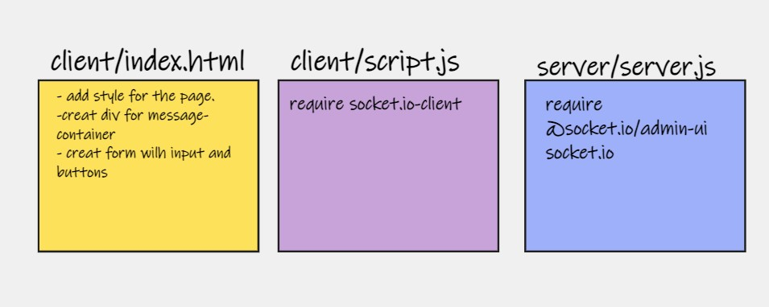

# chat-Socket.io
chat-Socket.io 

## UML

## Getting Started

- install packages (socket.io, socket.io-client ,nodemon, snowpack)
- index.html with a form which sends messages from the client and joins to a room .
- use node server.js to start the Event .
- [PR](https://github.com/ManalKhAlbahar/chat-Socket.io/pull/1).
